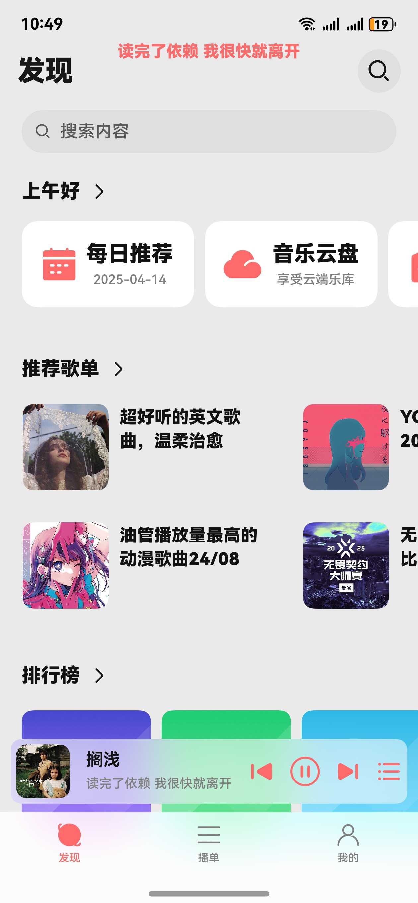
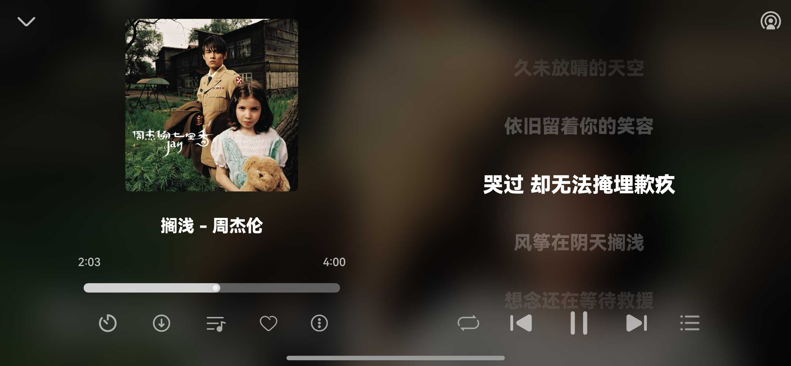

# Melotopia 🎧

✨ 鸿蒙原生音乐播放器 | 🚀 全场景设备适配

**本项目为第三方应用, 应用本身不提供在线服务, 仅提供UI界面**

---

## 📖 项目概述
**第三方开源音乐播放器**，基于HarmonyOS NEXT打造的全场景音乐体验应用。 

⚠️ **特别说明**：本应用仅提供UI界面与播放功能，默认不包含在线服务，用户需自行配置云端功能。

---

## 🛠️ 技术栈
| 类别        | 技术实现                      |  
|------------|---------------------------|  
| 开发语言    | ArkTS                     |  
| 系统API     | OHOS API 16               |  
| 最低版本    | HarmonyOS NEXT 5.0.0.150+ |  

---

## 📦 安装方式

#### 1.源码编译

```bash
git clone https://github.com/Chenlvin/Melotopia-HMOS
`````

#### 侧载安装

[Releases](https://github.com/Chenlvin/Melotopia-HMOS/releases)

---

## 可能出现的问题

#### 调试或运行出现“9568289 - install failed due to grant request permissions failed”

这是由于应用申请的一个权限： [ohos.permission.SYSTEM_FLOAT_WINDOW](https://developer.huawei.com/consumer/cn/doc/harmonyos-guides-V5/restricted-permissions-V5)

应用通过该权限, 创建悬浮窗以实现“浮动歌词”功能, 
该权限属于ACL受限开发权限, 需要使用
[ACL方式声明](https://developer.huawei.com/consumer/cn/doc/harmonyos-guides-V5/ide-signing-V5#section9786111152213)使用

权限对应代码位置: \entry\src\main\module.json5

````bash
{
          "name" : "ohos.permission.SYSTEM_FLOAT_WINDOW",
          "usedScene": {
            "abilities": [
              "EntryAbility"
            ],
            "when":"in"
          }
        },
````


## ⚠️ 免责声明

> ❗ **重要提示**：
> 1. 本应用为**纯界面实现层**，不内置/分发任何音源内容
> 2. 在线功能需用户**自行搭建合规服务**，由此产生的版权问题与开发者无关
> 3. 禁止将本项目用于商业用途或二次分发受版权保护的内容


## 联系邮箱

**📧 邮箱:** chenlvin126@outlook.com


## 界面预览
### Phone - 手机设备
|            **发现**            |           **音乐云盘**            |            **播放器**            |
|:----------------------------:|:-----------------------------:|:-----------------------------:|
|  |  |  |
|          **播放页功能**           |           **歌词界面**            |           **播放列表**            |
|  |   |   | 

|            **横屏播放器**             |
|:----------------------------:|
|  |

### Tablet - 平板设备
|**播控/歌词界面**|**平行界面**|
|:----------:|:----------:|
|||

### Foldable - 折叠设备
|**歌单页**|**播控/歌词界面**|
|:----------:|:----------:|
|||
